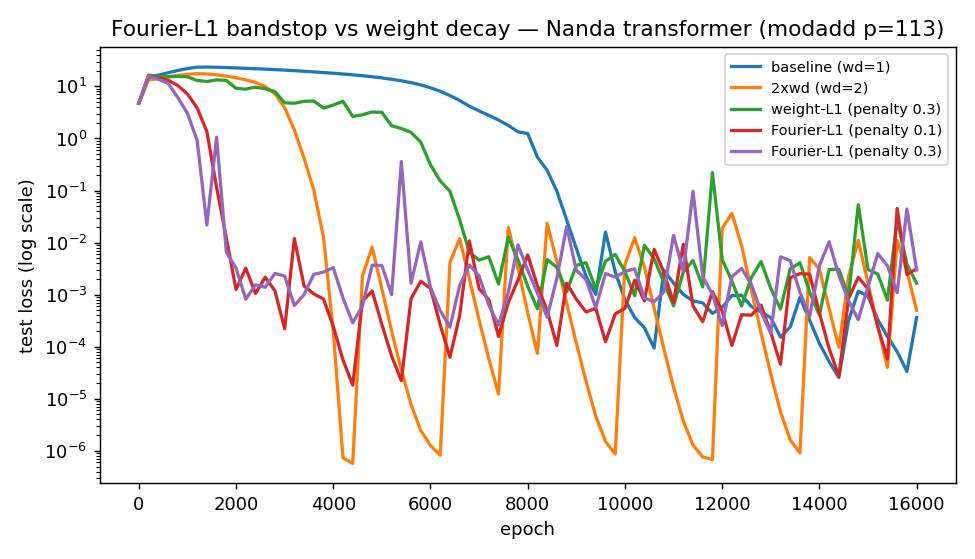
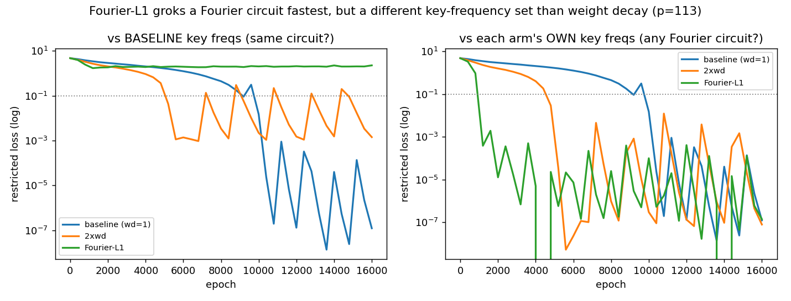

This note is a subthread of [[thread-basis-bottleneck|the basis-is-the-bottleneck]] thread, and the intervention counterpart to the [[grok-fourier-pr|participation-ratio]] note: there I showed the embedding's frequency concentration *leads* the grok; here I force that concentration and see whether it *causes* a faster grok. On modular addition it does, by about 5x, and the lever turns out to be frequency-domain norm-shedding specifically; weight decay reaches the same concentrated spectrum, but slowly, through a more uniform shedding.

## Setup

I train Nanda's 1-layer transformer from scratch: $a + b \bmod 113$, 30% of the pairs as train, AdamW (`lr = 1e-3`, `wd = 1`, betas `(0.9, 0.98)`), 16k epochs, 2 seeds. I mark the grok as the steepest drop in $-\log(\text{test loss})$, which is the same definition the PR note uses. The question is whether an explicit push toward a sparse frequency spectrum beats the implicit cleanup that weight decay does on its own. Using the same transformer means the intervention here and the observation in the PR note sit on the same model and task.

## The regularizer and the two controls

The grokked solution is sparse in the Fourier basis (a few key modes = the circle[2]); memorization is broadband. So the natural intervention is **Fourier-L1**: an L1 penalty on the DFT (over the symbol axis) of the embedding $W_E$, the *same* $E$ whose participation ratio the PR note tracks. L1 in the frequency domain shrinks everything but drives the small broadband coefficients to zero while keeping the large key modes; it is magnitude pruning of the Fourier spectrum that *also* sheds norm. (I avoid "bandstop": it prunes the weak broadband coefficients regardless of frequency rather than suppressing a contiguous band, so it is sparsification, not band-filtering.)

I ran two controls to isolate what Fourier-L1 actually buys:

- **2xwd:** double the weight decay; uniform shrinkage. If Fourier-L1 is just "more regularization," this should match it.
- **weight-L1:** an L1 penalty of the *same init magnitude*, but in the weight domain instead of the frequency domain. If any L1 sparsity will do, this should match Fourier-L1; if the frequency domain specifically matters, it won't.

I set each penalty by its *initial magnitude*: its size as a fraction of the training loss, i.e. a regularization strength, rather than a raw coefficient, since the coefficient is not comparable across the two domains (L1 of $\mathrm{DFT}(E)$ $\approx$ 6x L1 of $E$ at init). The strong Fourier-L1 and weight-L1 are matched at magnitude 0.3, so the *domain* is the only difference between them; the gentle Fourier-L1 sits at 0.1.

## Result

Epochs-to-grok (steepest drop in $-\log$ test loss), Nanda transformer, $p = 113$, 2 seeds:

| arm | epochs-to-grok | vs baseline |
|---|---|---|
| baseline (wd=1) | 8000 | 1.00x |
| 2xwd | 3700 | 2.16x |
| weight-L1 (penalty 0.3) | 5100 | 1.57x |
| Fourier-L1 (penalty 0.1) | 1400 | 5.71x |
| Fourier-L1 (penalty 0.3) | 1600 | 5.00x |

- **Fourier-L1 beats 2xwd ($\approx$5x vs 2.16x):** frequency-aware sparsity is not just more shrinkage.
- **Fourier-L1 beats weight-L1 at matched penalty magnitude ($\approx$5x vs 1.57x):** the *frequency domain* is what matters, not L1 sparsity in general.

So the speedup is specifically about shedding norm in the Fourier basis. The two penalty strengths land at about the same place (5.71x and 5.00x, within noise at 2 seeds), so I do not read a clean dose-response from this run. I also ran it on an MLP version of the same task ($a + b \bmod 31$, $\approx$4.6x), so the effect is not an artifact of one architecture.

## What this says

On this task, weight decay slowly prunes the Fourier spectrum: uniform shrinkage is the mechanism, and over training it starves the broadband memorization modes while the key Fourier modes survive, so the embedding's spectrum ends up sparse (a few high-energy modes over a pruned broadband floor). Applying that pruning directly in the frequency domain reaches a sparse Fourier spectrum far faster (a different one, as the circuit check below shows). Paired with the PR note, the picture is symmetric: concentration in the privileged basis *leads* the grok (observation), and *forcing* that concentration (specifically, frequency-domain norm-shedding) *causes* a faster grok (intervention).

## Same circuit, or a different one?

Does Fourier-L1 reach the *same* circuit as weight decay, only earlier, or just a lower loss? I trained all three arms on Nanda's exact transformer and tracked his **restricted (trig) loss**, the loss when the logits are restricted to a set of key Fourier frequencies, computed both against the baseline's key frequencies and against each arm's own; I also read off each arm's final key-frequency set.

The answer is *not* "same circuit, earlier":

- **Weight decay and 2×wd land on the same circuit.** Their key-frequency sets coincide (4/4 overlap) and 2×wd reaches that circuit about twice as fast (restricted loss crosses 0.1 at $\approx$5,200 vs $\approx$9,200). Same solution, faster.
- **Fourier-L1 lands on a different circuit.** Its key-frequency set overlaps the baseline's on only 2 of 4 and adds several new frequencies, so restricted loss against the baseline's frequencies never drops (left panel, flat green). Against *its own* frequencies it reaches a Fourier circuit fastest of all, at $\approx$1,200 (right panel). It does form a Fourier-multiplication circuit, just on a different frequency set, and it prunes some neurons to zero in the process.

So the explicit penalty does not merely accelerate the same solution; it *selects a different representative* within the same functional-equivalence class. Which frequencies survive is decided by the sparsification pressure, not by the task: weight decay is mode-agnostic and keeps whatever frequencies the initialization favored, while Fourier-L1 thresholds the spectrum and locks in a different sparse set. This is the [[thread-basis-bottleneck|thread]]'s gauge thesis in the training dynamics: the behavior is invariant to *which* modes carry it (the kernel only has to peak at the right place), so the mode set is a gauge coordinate the function does not pin down, and the regularizer moves that coordinate while leaving behavior intact. It is the within-algorithm cousin of clock-vs-pizza (Zhong et al.[3]), where *architecture* selects between two modular-addition algorithms; here a *regularizer* selects between frequency sets within the clock-like one.

## Caveats

- **One task, one architecture, two seeds:** This is $a + b \bmod 113$ on Nanda's 1-layer transformer. That weight decay slowly prunes the Fourier spectrum this way is a statement about *this* setting, where the privileged basis is the Fourier basis the cyclic group hands us; I make no claim about weight decay in general.
- **The circuit check is one seed, and the exact frequency set is noisy:** the "Same circuit?" result is a single seed per arm, and under MPS nondeterminism even the baseline's key-frequency set wobbles slightly run to run (4 vs 5 frequencies), so the precise sets should not be over-read. The robust facts survive it: baseline and 2×wd overlap heavily and reach the same circuit (2×wd faster), while Fourier-L1 overlaps little and reaches its own circuit far earlier.
- **It presupposes the basis, like the PR note:** The whole intervention needs the Fourier axis; on a task without a known symmetry you could not write down Fourier-L1 in the first place.
- **Measurement details:** Epochs-to-grok is the steepest drop in $-\log(\text{test loss})$, windowed to the grokking transition (the event the PR note's full-run argmax captures); on the full noisy curve a late low-loss spike can otherwise hijack the unwindowed argmax. Training is float32 plain cross-entropy (MPS, no float64 high-precision loss), 2 seeds, so the absolute baseline grok ($\approx$8,000) differs from the PR note's checkpoint ($\approx$10,700) by training run, not by threshold, and the post-grok tails oscillate (cleanup-phase noise) rather than settling smoothly.

## References
1. Alethea Power, Yuri Burda, Harri Edwards, Igor Babuschkin, Vedant Misra. *Grokking: Generalization Beyond Overfitting on Small Algorithmic Datasets.* arXiv:2201.02177, 2022. [arXiv:2201.02177](https://arxiv.org/abs/2201.02177)
2. Neel Nanda, Lawrence Chan, Tom Lieberum, Jess Smith, Jacob Steinhardt. *Progress Measures for Grokking via Mechanistic Interpretability.* ICLR 2023. [arXiv:2301.05217](https://arxiv.org/abs/2301.05217)
3. Ziqian Zhong, Ziming Liu, Max Tegmark, Jacob Andreas. *The Clock and the Pizza: Two Stories in Mechanistic Explanation of Neural Networks.* NeurIPS 2023. [arXiv:2306.17844](https://arxiv.org/abs/2306.17844)

### AI Disclaimer
*A large language model (LLM) was used in the drafting and editing of this content. The author reviewed and refined the text to ensure accuracy and maintain personal voice.*
