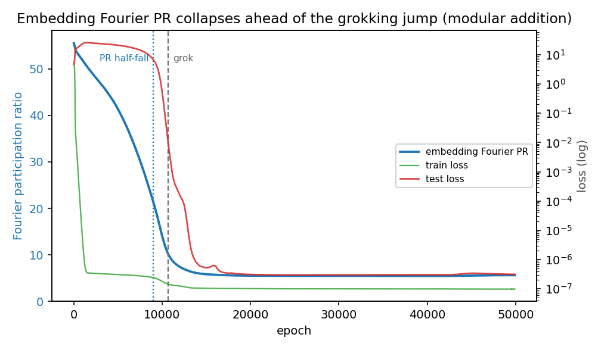

This note is a subthread of [[thread-basis-bottleneck|the basis-is-the-bottleneck]] thread. While the network is learning to grok modular addition, the embedding's Fourier **participation ratio** collapses by about 6.6x, and it does so *before* the test-loss jump.

## Setup

I use Nanda et al.'s[1] checkpointed grokking run: the standard one-layer transformer trained on $a + b \bmod p$ with $p = 113$, 30% of the pairs as the train set, weight decay 1, 50k epochs with a snapshot every 100. From each of the 500 checkpoints I read off the symbol embedding $E$, a $113 \times 128$ matrix, one 128-dimensional vector per input symbol. Nanda's analysis shows the grokked network solves the task in the Fourier domain: it embeds each symbol as a sparse combination of a few frequencies and recombines them with trigonometric identities. So the question is how *concentrated* the embedding is in frequency, and how that concentration moves over training.

## Participation ratio

Remove the per-dimension mean from $E$, take the DFT down the symbol axis, and for each frequency $k$ let $s_k$ be the total power at that frequency summed over the 128 hidden dimensions. The participation ratio is

$$\mathrm{PR} = \frac{\left(\sum_k s_k\right)^2}{\sum_k s_k^2}$$

which tells us the effective number of modes (physics more often uses its reciprocal, the inverse PR). If the energy spreads evenly over $m$ frequencies, $\mathrm{PR} = m$; if it piles onto one, $\mathrm{PR} = 1$. So PR is a scalar estimate of how many frequencies the embedding actually uses.

I picked PR for three reasons, and the third is the one I find most important:

1. **It is threshold-free and continuous:** PR is a smooth functional of the spectrum, so it tracks a gradual ramp rather than only a step. Since the thing I want to know is whether the concentration *leads or coincides with* the loss jump, I need a measure that moves continuously.
2. **The grokked solution is a few-frequency object:** Low PR is not a proxy for some loosely-related quantity; it is a direct measure of progress toward the representation the algorithm actually requires, which Nanda et al. showed has few Fourier modes. "PR has collapsed" and "the embedding has become the harmonic object the task is solved in" are the same statement.
3. **It is invariant to orthogonal changes of the hidden basis:** Because I sum power over the 128 hidden dimensions *before* forming the ratio, PR is unchanged if you rotate the embedding's hidden basis by any real orthogonal matrix (the DFT is linear along the symbol axis, so a real orthogonal $Q$ sends each frequency's row $F[k,:]$ to $F[k,:]\,Q$; although $F[k,:]$ is complex, a real orthogonal $Q$ is unitary, so it preserves the norm and every $s_k$ is invariant). PR therefore depends only on how energy is distributed across symbol-frequencies, not on the arbitrary internal coordinates the network uses: we read concentration in the privileged basis (here the Fourier basis, handed to us by the cyclic-group structure of the task) and quotient out the rotational gauge. The caveat is that the full reparameterization symmetry of a hidden layer is the general linear group (you can rescale or skew the basis and compensate downstream) so PR quotients the orthogonal part of the gauge, not all of it; orthogonal is the natural norm-preserving choice. So PR is a rotation-invariant scalar that reads concentration in the one basis that matters.

## Result

- PR collapses from a pre-grok mean of **37.2** to a post-grok mean of **5.6**, a **6.6x** drop. 5.6 is in the right ballpark for the handful of key frequencies the grokked circuit is known to use.
- The steepest test-loss drop, i.e. the "grok", is at **$\approx$epoch 10,671**.
- PR reaches the midpoint of its fall ($\approx$21) at **$\approx$epoch 8,988**, so the spectral concentration **leads the behavioral jump by $\approx$1,700 epochs**. At that point the test loss is still **6.8**; it had risen to $\approx$26 during memorization, so behaviorally the network still looks like it is overfitting.

So this is not a coincident snap. It's a ramp that is well underway while the test loss is still pinned high, and the loss only falls once the ramp has mostly completed.

## Relation to Nanda's progress measures

Nanda's restricted and excluded loss[1] already show the circuit forming before the grok, so the lead itself isn't new. The difference is what *kind* of measure this is: their progress measures are mechanism-keyed (you first identify the key frequencies) and loss-based (a forward pass on data), whereas PR is weight-only, parameter-free, and gauge-invariant, and needs the privileged basis but not the circuit. The cost is that PR is strictly less informative: it sees that the spectrum concentrated, not which frequencies the network uses or whether it uses them correctly, and it can't separate memorization from cleanup the way restricted vs excluded loss can.

A third family is basis-free: measures of the *complexity* of the learned function rather than its concentration in any basis, for instance the density of a network's linear/spline-partition regions, which collapses at grok and shows the phenomenon reaches well beyond modular addition, onto CNNs and ResNets (Humayun et al.[2]). These need no privileged basis precisely because they track how *complex* the map is, not *what* it recovered: high during memorization (dense regions there, loosely the input-space cousin of the broadband Fourier spectrum we track here) and low after grok. PR is the basis-dependent counterpart: it reports not just that complexity collapsed but onto *which* frequencies, at the price of needing the basis.

## Conclusions

The behavioral transition is a *thresholded readout* of a representational change that is already forming. The structure forms gradually in the privileged basis; the loss curve is a delayed, nonlinear indicator that only reports the change once the embedding is concentrated enough for the downstream computation to succeed. When you can name the right basis, "did the structure form?" becomes a smooth, leading, measurable quantity, and the dramatic behavioral jump is the *least* informative view of it.

It also makes grokking a clean control condition for recovery questions. Here the latent structure is known (the Fourier circles), the basis is handed to us by the task, and the measurement is unambiguous, so if a concentration measure like this fails to move on a harder problem, we can't say "the structure isn't there"; we have to ask whether we have the right basis to see it in.

## Caveats

- **PR presupposes the Fourier basis:** The whole measurement assumes the privileged basis, which the cyclic-group task hands us for free. For a task without a known symmetry you do not get that basis.
- **"Leads" is a description, not a cause:** I report that the PR midpoint precedes the steepest test drop on this run, not that the concentration *causes* generalization. The grok epoch is itself a choice (steepest drop in $-\log(\text{test loss})$).
- **A scalar is coarse:** A more thorough version would track PR per key-frequency, and against weight norm and restricted-loss progress measures, rather than collapsing everything to one number.

## References
1. Neel Nanda, Lawrence Chan, Tom Lieberum, Jess Smith, Jacob Steinhardt. *Progress Measures for Grokking via Mechanistic Interpretability.* ICLR 2023. [arXiv:2301.05217](https://arxiv.org/abs/2301.05217)
2. Ahmed Imtiaz Humayun, Randall Balestriero, Richard Baraniuk. *Deep Networks Always Grok and Here is Why.* arXiv:2402.15555, 2024. [arXiv:2402.15555](https://arxiv.org/abs/2402.15555)

### AI Disclaimer
*A large language model (LLM) was used in the drafting and editing of this content. The author reviewed and refined the text to ensure accuracy and maintain personal voice.*